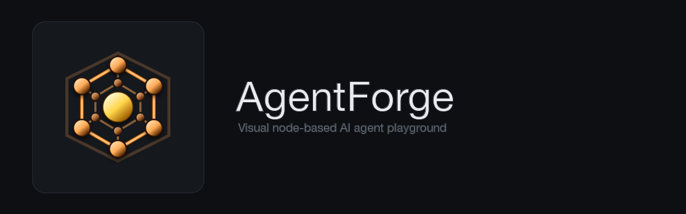
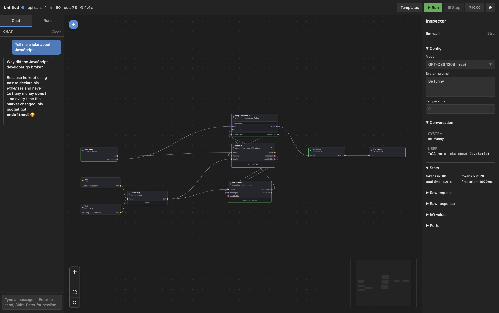

<div align="center">
  
</div>

<div align="center">

# AgentForge

**Visual playground for building, running, and inspecting AI agents.**

[](https://github.com/MatjazAkeo/agentforge/releases/latest)
[](#license)
[](https://tauri.app/)
[](https://vuejs.org/)

A local-first desktop app that lets you compose AI agents on a node-based canvas — wire prompts, LLM calls, tools, loops, and chat — and see every byte of every step.

[Download](https://github.com/MatjazAkeo/agentforge/releases/latest) · [Wiki](https://github.com/MatjazAkeo/agentforge/wiki) · [Templates Tutorial](https://github.com/MatjazAkeo/agentforge/wiki/Templates) · [Codegen spec](CODEGEN.md)

</div>

---

<div align="center">
  
</div>

---

## What it is

AgentForge turns the typical "open a Python file, hand-roll a ReAct loop, watch logs scroll by" workflow into something you can **see**. Drag nodes onto a grid, connect them with typed wires, click Run, and inspect every request, response, token, and per-iteration state. When you're happy with the logic, take it to production using the [codegen spec](CODEGEN.md) — no SDK lock-in.

Built around **learning by building**, not shipping a workflow product.

## Features

- **Visual canvas** — drag nodes onto a grid, wire them with type-aware ports. Mismatched wires are rejected at connect time.
- **Streaming LLM Call** — connects to OpenRouter; tokens stream live onto the node card and into the inspector.
- **Sandboxed tools** — write JavaScript that the model can call. Each invocation runs in a Web Worker with a configurable timeout.
- **Loop Controller** — declarative cycle anchor. Build ReAct, retry, or self-critique loops on the canvas with full per-iteration inspection.
- **Agent node** — convenience wrapper for the LLM↔tool loop, using the same primitives as the raw nodes.
- **Chat sidebar** — when a graph has a Chat Input + Chat Output, the left sidebar swaps into a real chat thread; each submission triggers a Run.
- **Six bundled templates** — Hello Model, Two-Model Comparison, Self-Critique Loop (with conditional halt), RAG-lite, Raw ReAct Chat, Encapsulated Agent Chat. Accessible from the toolbar.
- **Live metrics + cost** — api calls, tokens in/out, elapsed time, and per-run cost (for paid models) update on the toolbar as the graph runs. Account balance is one click away.
- **Persistent run history** — every execution saved as JSON next to the graph file. Click any past run to reload its full state into the canvas.
- **Light / dark / system themes** — switchable from Settings → General.
- **Browse OpenRouter models in-app** — search the catalog, filter by free / supports-tools, see uptime and pricing chips, add or remove models from your list with one click.
- **Auto-update** — releases ship with signed update bundles; the app prompts you when a new version is published.
- **Codegen spec** — `CODEGEN.md` is a machine-readable, SDK-agnostic spec for translating any graph to TypeScript or Python (and back). Hand it to Claude / Codex / Cursor to ship a graph as production code.

## Quickstart

### Download a release (recommended)

Grab the installer for your platform from [Releases](https://github.com/MatjazAkeo/agentforge/releases/latest):

| Platform | File |
|---|---|
| macOS (Apple Silicon + Intel) | `AgentForge_<ver>_universal.dmg` |
| Linux (Debian/Ubuntu) | `agentforge_<ver>_amd64.deb` |
| Linux (other distros) | `AgentForge_<ver>_amd64.AppImage` |
| Linux (Fedora/RHEL) | `AgentForge-<ver>-1.x86_64.rpm` |
| Windows | `AgentForge_<ver>_x64-setup.exe` |

### Build from source

Prerequisites: [Rust toolchain](https://rustup.rs/), Node.js 20+, Xcode Command Line Tools (macOS) or the platform equivalent.

```bash
git clone https://github.com/MatjazAkeo/agentforge.git
cd agentforge
npm install
npm run tauri dev
```

### First launch

The welcome screen prompts for your [OpenRouter](https://openrouter.ai/) API key (free models work for everything in the bundled templates). The key is stored in your **OS keychain** — never on disk in graph files.

### macOS Gatekeeper

The app isn't signed with an Apple Developer certificate, so macOS Gatekeeper blocks it the first time. Modern macOS no longer offers a right-click "Open" bypass — you'll see *"Apple could not verify AgentForge is free of malware"* with only **Done** and **Move to Bin** buttons.

To open the app:

1. Try to open AgentForge once → click **Done** on the warning.
2. Open **System Settings → Privacy & Security**, scroll to the bottom security section.
3. You'll see *"AgentForge was blocked because it's not from an identified developer"* with an **Open Anyway** button.
4. Click **Open Anyway**, authenticate, and the app launches. macOS remembers; future launches just work.

## Usage

1. Click **+** on the canvas (or right-click, or press ⌘K) to open the add-node menu.
2. Wire nodes by dragging from a source port to a target port. Compatible types snap together.
3. Click **▶ Run** in the toolbar.
4. Click any node to inspect its inputs, outputs, request/response, and (inside loops) per-iteration history in the right panel.

The **Templates** button in the toolbar loads a runnable starter graph — try **Encapsulated Agent (chat)** to see a multi-turn agent that calls tools, end-to-end. Walkthroughs live in the [Templates Tutorial](https://github.com/MatjazAkeo/agentforge/wiki/Templates) on the wiki.

## From graph to production code

Once a graph behaves the way you want, [`CODEGEN.md`](CODEGEN.md) tells any AI coding assistant (Claude, Codex, Cursor, …) how to translate it to TypeScript or Python — without locking you into a specific SDK. The same spec works in reverse: paste a hand-written agent loop, get a graph back.

## Building installers

```bash
npm run tauri build
```

Produces a platform-native installer in `src-tauri/target/release/bundle/`.

## Tech stack

| Layer | Tech |
|---|---|
| Shell | [Tauri 2](https://tauri.app/) (Rust) |
| Frontend | Vue 3 + Composition API, Pinia, [Vue Flow](https://vueflow.dev/), Tailwind CSS v4 |
| Editor | Monaco (tool code, prompt templates, custom Transform JS) |
| LLM | [OpenRouter](https://openrouter.ai/) via streaming SSE |
| Engine | Custom topological scheduler with cycle support (Loop Controller) |
| Tests | Vitest + MSW |

## Project layout

```
src/
├── domain/         pure types
├── stores/         Pinia stores (graph, run, settings, chat, ui, update)
├── nodes/          node definitions + registry + port-types
├── engine/         scheduler, runner, loop-driver, abort
├── components/     Layout, Toolbar, Canvas, Inspector, settings tabs, ...
├── openrouter/     streaming SSE client + model catalog fetcher + credits
├── persistence/    graph save/load + run-dir helpers
├── secrets/        keychain bridge
├── templates/      bundled starter graphs
└── config/         default model list

src-tauri/          Rust shell — window menu, keychain commands, plugin registration
scripts/            build helpers (e.g. wiki SVG generator)
.github/workflows/  multi-OS release pipeline (auto-publish on tag)
CODEGEN.md          graph ↔ code spec for AI agents
```

## Status

Active development. The full v1 node set is shipped and runnable: Input, Output, LLM Call, Tool, Tool Group, Tool Runner, Loop Controller, Agent, Transform, Prompt Template, Chat Input, Chat Output. Bundled templates, run persistence, theme switching, the in-app model browser, balance + per-run cost readouts, and signed auto-updates are working.

See [CHANGELOG.md](CHANGELOG.md) for the full release history.

## Contributing

Issues and PRs welcome. The scope is intentionally narrow — open an issue first to discuss bigger changes.

## License

[MIT](LICENSE) © MatjazAkeo
